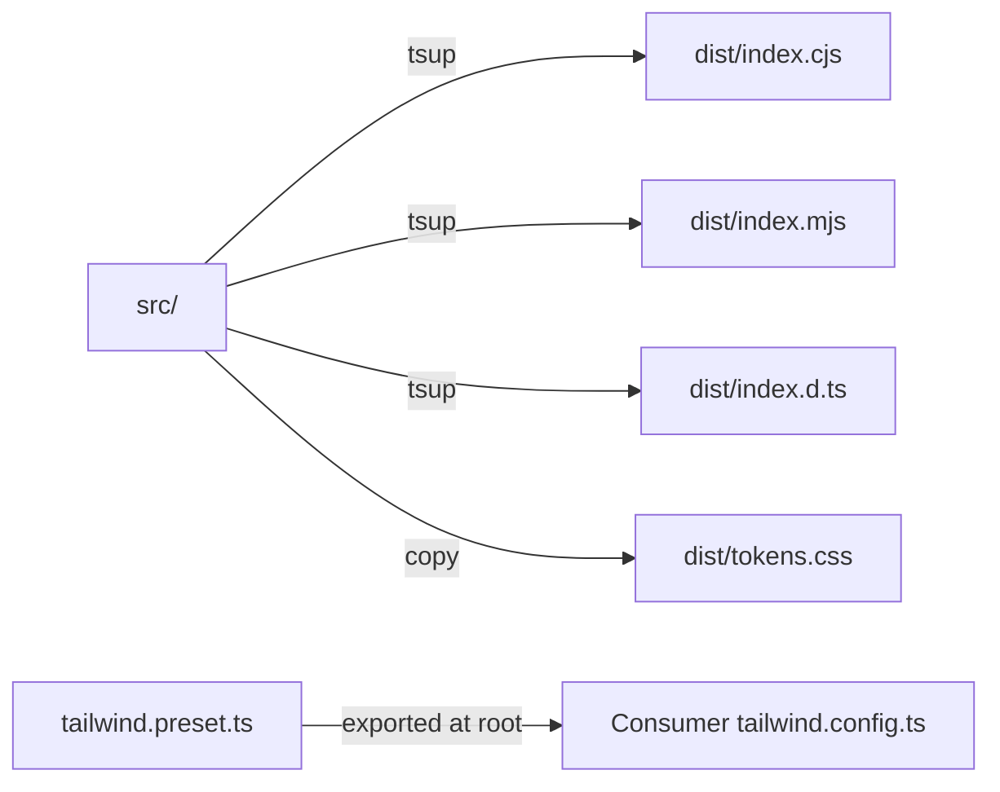
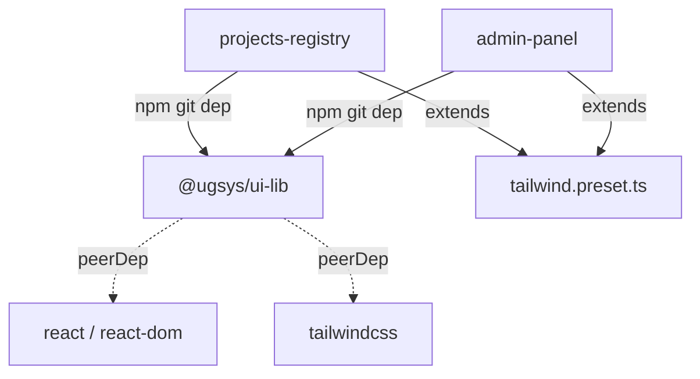

# Design Document — Shared UI Library (`ugsys-ui-lib`)

## Overview

`ugsys-ui-lib` is a standalone React component library that encapsulates the AWS User Group Cochabamba visual design system. It provides design tokens (CSS custom properties + Tailwind preset), layout components (Navbar, Footer), and an authenticated UserMenu with role-based admin entry — all distributed as an npm git dependency.

The library is router-agnostic: it renders plain `<a>` tags by default but accepts a `renderLink` prop so consumers can inject their own router-aware link component (react-router-dom v6 or v7). This avoids coupling the library to any specific router version.

Both consumers (projects-registry with Tailwind v4 + React 19, admin-panel with React 18) install the library via `github:awscbba/ugsys-ui-lib#v<version>` and extend its Tailwind preset.

## Architecture

### Library Structure

```
ugsys-ui-lib/
├── src/
│   ├── components/
│   │   ├── Navbar/
│   │   │   ├── Navbar.tsx
│   │   │   └── index.ts
│   │   ├── Footer/
│   │   │   ├── Footer.tsx
│   │   │   └── index.ts
│   │   └── UserMenu/
│   │       ├── UserMenu.tsx
│   │       ├── AdminEntry.tsx
│   │       └── index.ts
│   ├── hooks/
│   │   └── useFocusManagement.ts
│   ├── tokens/
│   │   └── tokens.css
│   ├── types.ts              # Shared prop types (LinkItem, UserInfo, etc.)
│   └── index.ts              # Barrel export
├── tailwind.preset.ts        # Tailwind v4 preset with brand tokens
├── tsup.config.ts            # Build config: CJS + ESM + .d.ts
├── tsconfig.json
├── package.json
├── vitest.config.ts
├── eslint.config.js
├── justfile
├── CHANGELOG.md
└── tests/
    ├── Navbar.test.tsx
    ├── Footer.test.tsx
    ├── UserMenu.test.tsx
    └── setup.ts
```

### Build Pipeline



tsup produces CJS + ESM + TypeScript declarations. The `tokens.css` file is copied into `dist/` so consumers can import it directly. The Tailwind preset lives at the package root (not in `dist/`) so consumers reference it as `require("@ugsys/ui-lib/tailwind.preset")`.

### Export Map (package.json)

```json
{
  "name": "@ugsys/ui-lib",
  "main": "./dist/index.cjs",
  "module": "./dist/index.mjs",
  "types": "./dist/index.d.ts",
  "exports": {
    ".": {
      "import": "./dist/index.mjs",
      "require": "./dist/index.cjs",
      "types": "./dist/index.d.ts"
    },
    "./tokens.css": "./dist/tokens.css",
    "./tailwind.preset": "./tailwind.preset.ts"
  },
  "peerDependencies": {
    "react": "^18.0.0 || ^19.0.0",
    "react-dom": "^18.0.0 || ^19.0.0",
    "tailwindcss": "^4.0.0"
  }
}
```

### Dependency Direction



The library has zero runtime dependencies beyond peer deps. No react-router-dom, no nanostores, no state management.

## Components and Interfaces

### Shared Types (`src/types.ts`)

```typescript
/** Router-agnostic link renderer. Consumers inject their router's Link component. */
export type RenderLink = (props: {
  href: string;
  children: React.ReactNode;
  className?: string;
  onClick?: () => void;
  role?: string;
  tabIndex?: number;
  "aria-current"?: "page" | undefined;
}) => React.ReactNode;

/** Default renderLink — plain <a> tag */
export const defaultRenderLink: RenderLink = ({ href, children, ...rest }) => (
  <a href={href} {...rest}>{children}</a>
);

/** Navigation link descriptor */
export interface LinkItem {
  label: string;
  href: string;
  active?: boolean;
  external?: boolean;
}

/** Authenticated user info passed to UserMenu */
export interface UserInfo {
  name: string;
  email: string;
  avatarUrl?: string;
  roles: string[];
}

/** Extra menu item for UserMenu extensibility */
export interface ExtraMenuItem {
  label: string;
  href?: string;
  onClick?: () => void;
  icon?: React.ReactNode;
}
```

### Navbar Component

```typescript
export interface NavbarProps {
  /** Navigation links to render */
  links: LinkItem[];
  /** Slot for UserMenu or auth buttons on the right side */
  userMenuSlot?: React.ReactNode;
  /** Router-aware link renderer (defaults to plain <a>) */
  renderLink?: RenderLink;
  /** Brand subtitle text (e.g., "Registro de Proyectos"). Defaults to none. */
  brandSubtitle?: string;
}
```

Behavior:
- Renders brand wordmark "AWS User Group Cochabamba" on the left with `text-brand` (#FF9900) subtitle
- Desktop (≥768px): horizontal nav links + userMenuSlot on the right
- Mobile (<768px): hamburger button toggles a vertical menu panel
- Active links get `bg-brand text-primary` highlight (orange bg, dark text)
- External links (`external: true`) render with `target="_blank" rel="noopener noreferrer"`
- All interactive elements have `focus-visible:outline-2 focus-visible:outline-accent` ring
- Hamburger toggle operable via Enter/Space, nav has `aria-label`

### Footer Component

```typescript
export interface FooterProps {
  /** Copyright year */
  year: number;
  /** Optional link list */
  links?: LinkItem[];
  /** Router-aware link renderer */
  renderLink?: RenderLink;
}
```

Behavior:
- `bg-footer` (#333333) background, light text (#F8F8F8) for contrast
- Renders "© {year} AWS User Group Cochabamba" copyright
- Optional links rendered as a horizontal list
- Focus rings use `ring-accent` (#4A90E2)

### UserMenu Component

```typescript
export interface UserMenuProps {
  /** Authenticated user info */
  user: UserInfo;
  /** Logout callback */
  onLogout: () => void;
  /** URL to admin panel — renders AdminEntry when user has "admin" role */
  adminPanelUrl?: string;
  /** Profile page href (e.g., "/dashboard") */
  profileHref?: string;
  /** Additional menu entries injected by consumer */
  extraItems?: ExtraMenuItem[];
  /** Router-aware link renderer */
  renderLink?: RenderLink;
}
```

Behavior:
- Trigger button shows avatar image (if `avatarUrl` provided) or initials circle (`bg-brand text-primary`)
- Click or Enter/Space on trigger opens dropdown
- Dropdown has `role="menu"`, items have `role="menuitem"`
- Arrow keys navigate items, Home/End jump to first/last, Escape closes and returns focus to trigger
- Focus is trapped within the dropdown while open
- Header shows user name + email
- "Mi Perfil" link navigates to `profileHref` (default: no profile link if omitted)
- AdminEntry: rendered only when `user.roles.includes("admin") && adminPanelUrl` is truthy — labeled "Panel de Administración", visually distinguished with `text-brand` accent, navigates via `<a href={adminPanelUrl}>`
- "Cerrar Sesión" button invokes `onLogout`, styled in red
- Outside click closes dropdown

### AdminEntry (internal sub-component)

```typescript
// Internal to UserMenu — not exported from the library
interface AdminEntryProps {
  adminPanelUrl: string;
  onClose: () => void;
}
```

Rendered inside UserMenu dropdown only when conditions are met. Uses an `<a>` tag (same-tab navigation). Visually distinguished with a shield/admin icon in `text-brand` color.

### useFocusManagement Hook

Extracted from the projects-registry implementation. Manages focus lifecycle for dropdown open/close:
- Stores previously focused element on open
- Moves focus into the dropdown after render
- Restores focus to trigger on close
- SSR-safe

Exported from the library for consumers who need dropdown focus management in custom components.

## Data Models

### Design Tokens (`src/tokens/tokens.css`)

```css
:root {
  /* Brand palette */
  --color-primary: #161d2b;
  --color-brand: #FF9900;
  --color-accent: #4A90E2;
  --color-footer: #333333;
  --color-background: #F8F8F8;

  /* Focus */
  --color-focus-ring: #4A90E2;

  /* Typography */
  --font-sans: "Open Sans", ui-sans-serif, system-ui, sans-serif;
}
```

### Tailwind Preset (`tailwind.preset.ts`)

```typescript
import type { Config } from "tailwindcss";

export default {
  theme: {
    extend: {
      colors: {
        primary: "var(--color-primary)",
        brand: "var(--color-brand)",
        accent: "var(--color-accent)",
        footer: "var(--color-footer)",
        background: "var(--color-background)",
      },
      fontFamily: {
        sans: ["Open Sans", "ui-sans-serif", "system-ui", "sans-serif"],
      },
      ringColor: {
        accent: "var(--color-focus-ring)",
      },
    },
  },
} satisfies Partial<Config>;
```

### Consumer Integration Patterns

#### projects-registry (`web/tailwind.config.ts`)

```typescript
import ugsysPreset from "@ugsys/ui-lib/tailwind.preset";

export default {
  presets: [ugsysPreset],
  content: [
    "./src/**/*.{ts,tsx}",
    "./node_modules/@ugsys/ui-lib/dist/**/*.{js,mjs}",
  ],
};
```

```tsx
// web/src/components/layout/Layout.tsx
import { Navbar, Footer, UserMenu } from "@ugsys/ui-lib";
import "@ugsys/ui-lib/tokens.css";
import { NavLink } from "react-router-dom";

// Router-aware link renderer for react-router-dom v7
const renderLink: RenderLink = ({ href, children, className, ...rest }) => (
  <NavLink to={href} className={className} {...rest}>{children}</NavLink>
);

export default function Layout() {
  const { user, logout } = useAuth();
  const links = [
    { label: "Proyectos", href: "/", active: location.pathname === "/" },
    { label: "Sitio Principal", href: "https://cbba.cloud.org.bo/aws", external: true },
  ];

  return (
    <div className="flex flex-col min-h-screen">
      <Navbar
        links={links}
        renderLink={renderLink}
        brandSubtitle="Registro de Proyectos"
        userMenuSlot={
          user ? (
            <UserMenu
              user={{ name: user.email, email: user.email, roles: user.roles ?? [], avatarUrl: undefined }}
              onLogout={logout}
              adminPanelUrl="https://admin.apps.cloud.org.bo"
              profileHref="/dashboard"
              renderLink={renderLink}
            />
          ) : <AuthButtons renderLink={renderLink} />
        }
      />
      <main className="flex-1"><Outlet /></main>
      <Footer year={2025} renderLink={renderLink} />
    </div>
  );
}
```

#### admin-panel (`admin-shell/`)

The admin panel does NOT use Navbar or Footer. It consumes:
1. `tokens.css` — for CSS custom properties
2. Tailwind preset — for utility classes (`bg-primary`, `text-brand`, etc.)
3. Optionally the UserMenu trigger element pattern for the TopBar

Migration mapping:
| Current (inline) | New (Tailwind + tokens) |
|---|---|
| Sidebar `background: "#1e1e2e"` | `bg-primary` (#161d2b) |
| Sidebar active `color: "#cba6f7"` | `text-brand` (#FF9900) |
| Sidebar active border `#cba6f7` | `border-brand` (#FF9900) |
| TopBar `background: "#fff"` | `bg-primary text-white` |
| Login button `background: "#6366f1"` | `bg-brand` (#FF9900) |
| Avatar fallback `#6366f1` | `bg-brand text-primary` |


## Correctness Properties

*A property is a characteristic or behavior that should hold true across all valid executions of a system — essentially, a formal statement about what the system should do. Properties serve as the bridge between human-readable specifications and machine-verifiable correctness guarantees.*

### Property 1: Navbar renders all provided links

*For any* array of `LinkItem` objects (with non-empty labels and valid hrefs), rendering a `Navbar` with that `links` prop should produce exactly one accessible link element per item, and each rendered link's text content should match the corresponding `label`.

**Validates: Requirements 3.1**

### Property 2: Navbar active link indicator

*For any* array of `LinkItem` objects where some have `active: true` and others have `active: false` (or undefined), the Navbar should apply the brand highlight class (`bg-brand`) only to the links marked `active: true`, and no other links should have that class.

**Validates: Requirements 3.6**

### Property 3: Footer renders year and links

*For any* valid year number (1970–2100) and any array of `LinkItem` objects, the Footer should render a copyright string containing the year, and should render one link element per item in the links array with matching label text.

**Validates: Requirements 4.1, 4.2**

### Property 4: UserMenu avatar vs initials display

*For any* `UserInfo` object, if `avatarUrl` is a non-empty string then the UserMenu trigger should contain an `` element with that URL as `src`; if `avatarUrl` is undefined or empty, the trigger should contain a text element with the user's initials (derived from `name`) and no `` element.

**Validates: Requirements 5.2**

### Property 5: UserMenu renders all extra items

*For any* array of `ExtraMenuItem` objects (with non-empty labels), when the UserMenu dropdown is open, each extra item should appear as a `menuitem` element with matching label text, and the total number of extra menuitems should equal the length of the `extraItems` array.

**Validates: Requirements 5.6**

### Property 6: AdminEntry visibility is determined by role and URL

*For any* `UserInfo` object and any `adminPanelUrl` value (string or undefined), the AdminEntry ("Panel de Administración") should be visible in the open dropdown if and only if `user.roles` includes `"admin"` AND `adminPanelUrl` is a non-empty string. When visible, the AdminEntry's anchor `href` should equal the provided `adminPanelUrl`.

**Validates: Requirements 6.2, 6.3, 6.4**

## Error Handling

### Component Error Boundaries

The library does NOT include its own error boundary — consumers are expected to wrap library components in their own `ErrorBoundary` (both projects-registry and admin-panel already have one). This avoids the library swallowing errors that consumers need to handle.

### Prop Validation

- `links` prop: Empty arrays are valid (renders no links). Components handle `undefined` gracefully via default props.
- `user` prop: Required on UserMenu. If `name` is empty string, initials fallback renders "?" or first char of email.
- `onLogout`: Required callback. If it throws, the error propagates to the consumer's error boundary.
- `adminPanelUrl`: `undefined` or empty string means no AdminEntry rendered. No validation needed — falsy check suffices.
- `year`: Any number is accepted. No range validation (consumer responsibility).
- `renderLink`: Falls back to `defaultRenderLink` (plain `<a>`) if not provided.

### Keyboard Navigation Edge Cases

- If dropdown has zero items (no profile link, no extra items, no admin entry, only logout), arrow key navigation still works with the single logout item.
- If `extraItems` contains items with both `href` and `onClick`, the `onClick` fires first, then navigation occurs (standard anchor behavior).
- Focus trap handles the case where the dropdown is removed from DOM while open (e.g., parent unmount) — the `useFocusManagement` hook checks `document.body.contains()` before restoring focus.

## Testing Strategy

### Dual Testing Approach

The library uses both unit tests (specific examples, edge cases) and property-based tests (universal properties across generated inputs). Both are complementary and required for comprehensive coverage.

### Test Stack

- **Test runner**: Vitest 2.x (matches both consumers)
- **DOM**: jsdom
- **Component testing**: @testing-library/react + @testing-library/user-event
- **Property-based testing**: fast-check 3.x (already used in both consumers)
- **Accessibility lint**: eslint-plugin-jsx-a11y (build-time, not runtime)

### Unit Tests (examples and edge cases)

| Component | Test | Type |
|---|---|---|
| Navbar | Renders brand wordmark "AWS User Group Cochabamba" | example |
| Navbar | Applies `bg-primary` class to header element | example |
| Navbar | External links have `target="_blank"` and `rel="noopener noreferrer"` | example |
| Navbar | Hamburger button has `aria-expanded` attribute | example |
| Navbar | `userMenuSlot` content renders in the right position | example |
| Navbar | Nav element has `aria-label` | example |
| Footer | Applies `bg-footer` class | example |
| Footer | Text uses light color class for contrast | example |
| Footer | Empty links array renders no link elements | edge case |
| UserMenu | Click opens dropdown with `role="menu"` | example |
| UserMenu | Enter/Space on trigger opens dropdown | example |
| UserMenu | Escape closes dropdown and returns focus to trigger | example |
| UserMenu | ArrowDown/ArrowUp navigate menuitems | example |
| UserMenu | Home/End jump to first/last menuitem | example |
| UserMenu | Outside click closes dropdown | example |
| UserMenu | `onLogout` callback invoked on logout click | example |
| UserMenu | Dropdown items have `role="menuitem"` | example |
| UserMenu | AdminEntry has `text-brand` class for visual distinction | example |
| UserMenu | Profile link renders when `profileHref` provided | example |
| UserMenu | Profile link absent when `profileHref` omitted | example |
| useFocusManagement | Focus moves to modal ref on open | example |
| useFocusManagement | Focus restores to previous element on close | example |

### Property-Based Tests (fast-check)

Each property test runs a minimum of 100 iterations. Each test is tagged with a comment referencing the design property.

| Property | Generator Strategy | Tag |
|---|---|---|
| Property 1: Navbar renders all links | `fc.array(fc.record({ label: fc.string({minLength:1}), href: fc.webUrl(), active: fc.boolean(), external: fc.boolean() }), {minLength:0, maxLength:20})` | `Feature: shared-ui-library, Property 1: Navbar renders all provided links` |
| Property 2: Navbar active indicator | Same as above, ensure mix of active/inactive | `Feature: shared-ui-library, Property 2: Navbar active link indicator` |
| Property 3: Footer year and links | `fc.tuple(fc.integer({min:1970, max:2100}), fc.array(fc.record({label: fc.string({minLength:1}), href: fc.webUrl()}), {maxLength:10}))` | `Feature: shared-ui-library, Property 3: Footer renders year and links` |
| Property 4: Avatar vs initials | `fc.record({ name: fc.string({minLength:1}), email: fc.emailAddress(), avatarUrl: fc.option(fc.webUrl()), roles: fc.array(fc.string()) })` | `Feature: shared-ui-library, Property 4: UserMenu avatar vs initials display` |
| Property 5: Extra items rendering | `fc.array(fc.record({ label: fc.string({minLength:1}), href: fc.option(fc.webUrl()) }), {minLength:0, maxLength:10})` | `Feature: shared-ui-library, Property 5: UserMenu renders all extra items` |
| Property 6: AdminEntry visibility | `fc.tuple(fc.record({ name: fc.string({minLength:1}), email: fc.emailAddress(), roles: fc.array(fc.constantFrom("admin","user","editor")) }), fc.option(fc.webUrl()))` | `Feature: shared-ui-library, Property 6: AdminEntry visibility is determined by role and URL` |

### Coverage Gate

- 80% line coverage minimum (enforced by Vitest coverage reporter in CI)
- Target 90%+ for component logic
- Coverage excludes `index.ts` barrel exports and type-only files

### CI Quality Gates

| Job | Tool | Blocks merge? |
|---|---|---|
| Type check | `tsc --noEmit` (strict) | Yes |
| Lint | ESLint + `eslint-plugin-jsx-a11y` | Yes |
| Unit + property tests | `vitest run --coverage` | Yes |
| Coverage gate | 80% line coverage | Yes |
| Build | `tsup` (CJS + ESM + .d.ts) | Yes |
| Secret scan | Gitleaks | Yes |
